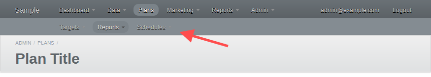

# ActiveAdmin::Subnav

[](http://badge.fury.io/rb/active_admin-subnav)

Enhanced sub-navigation for nested ActiveAdmin resources.

Currently, the base [ActiveAdmin][] resets the top navigation menu to display the
nested navigation menu, but it can be confusing to lose the main navigation
context. This project keeps the main navigation visible and displays a secondary
navigation bar for nested resources.



Supports both ActiveAdmin v1.0.0+ and older v0.6.4+ versions.

**Note**: Optional belongs_to configurations are not supported!

## Usage

Resource `belongs_to` configuration does not require any extra configuration
beyond the default. Below the Post resource belongs to Site.

```ruby
# admin/site.rb
ActiveAdmin.register Site

# admin/post.rb
ActiveAdmin.register Post do
  belongs_to :site
end
```

Registering `belongs_to` pages requires more setup to properly access the
parent record. This is a side effect of how [Arbre][] references parent
HTML nodes. Below a new method, `#site`, is created to provide access to the
parent record.

```ruby
# admin/site_statistics.rb
ActiveAdmin.register_page "Statistics" do
  belongs_to :site

  content do
    statistics = site.statistics
    # ...
  end

  controller do

    # Provide access to the parent resource record: Site.
    #
    # Without this extra setup the parent record will not be accessible. Any
    # calls to `#parent` will return the Arbre parent element and not the
    # ActiveAdmin resource.
    alias_method :site, :parent

    # Expose the method as a helper making it available to the view
    helper_method :site

  end
end
```

## Installation

Add this line to your application's Gemfile:

```ruby
gem 'active_admin-subnav'
```

And then execute:

    $ bundle

Add the subnav's styles to your `active_admin.css.scss` stylesheet:

```scss
//= require active_admin/subnav

// Align subnav with main navigation by padding the width of the site's
// title.
#header div.subnav {
  padding-left: 8.333em;
}
```

## Contributing

1. Fork it ( https://github.com/zorab47/active_admin-subnav/fork )
2. Create your feature branch (`git checkout -b my-new-feature`)
3. Commit your changes (`git commit -am 'Add some feature'`)
4. Push to the branch (`git push origin my-new-feature`)
5. Create a new Pull Request
 
## Versioning

Follows [Semantic Versioning 2.0.0][Semver]

[ActiveAdmin]: https://github.com/gregbell/active_admin
[Semver]: http://semver.org/spec/v2.0.0.html
[Arbre]: https://github.com/activeadmin/arbre
